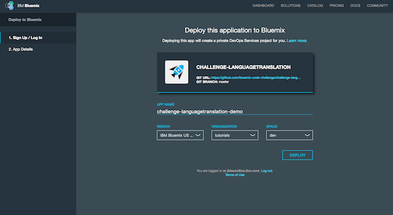
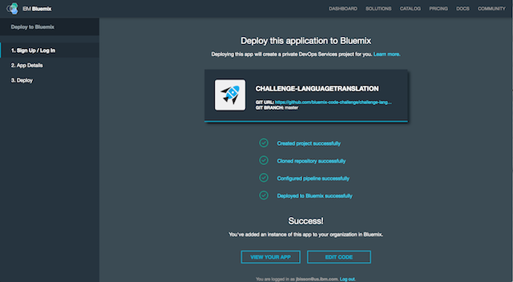
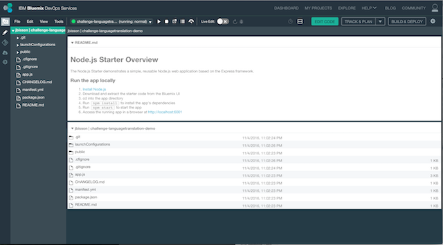
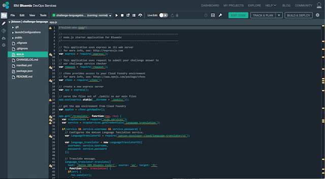
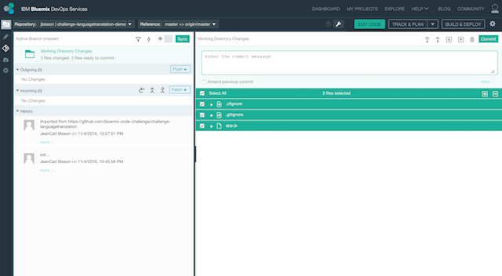
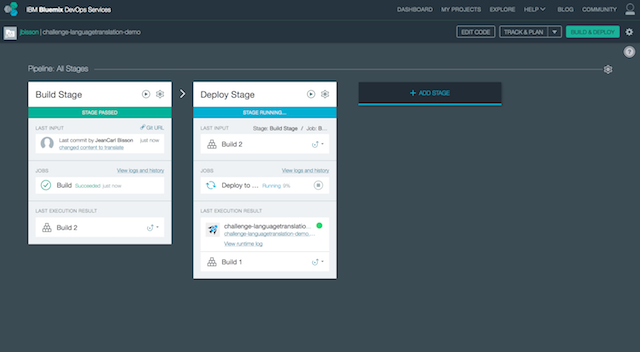

# Code Challenge: Language Translator
In this challenge you will work with a Node.js translation application hosted on the [IBM Bluemix DevOps Services] (https://hub.jazz.net) cloud and using the [Language Translator](https://www.ibm.com/watson/developercloud/language-translator.html) service in the [IBM Bluemix cloud](https://bluemix.net/). 

You can test the [Bluemix Translator Service demo](https://language-translator-demo.mybluemix.net/), study up on the [**Language Translator API Reference**] (http://www.ibm.com/watson/developercloud/language-translator/api/v2/) and read [**the Translator Documentation.**](http://www.ibm.com/watson/developercloud/doc/language-translator/) 

## Running the app on Bluemix
1. [](./img/createaccount.png)
Creating a Bluemix is easy. For a detailed desription, check this YouTube video: https://www.youtube.com/watch?v=kUPwdfL8_oU&t=23s 
Deploy the challenge application

 [](https://bluemix.net/deploy?repository=https://github.com/bluemix-code-challenge/challenge-languagetranslation.git)

2. Enter an application name. The host you choose will determinate the subdomain of your application's URL: `<host>.mybluemix.net`.

  [](./img/deploy.png)

3. Wait for the deployment to complete. Click on Edit Code.

  [](./img/deploymentsummary.png)

4. The IBM Bluemix DevOps Services tools allow you to edit code in the browser, configure a pipeline of processes to execute when new code is committed, and deploy applications automatically to IBM Bluemix.

  Select `app.js` to edit the application source code.

  [](./img/devops.png)

5. In this challenge, we’ll translate a piece of text into Spanish.

  [](./img/editor.png)

6. Replace the following code to translate the text `Hello IBM Bluemix user!` into Spanish. Change the target language from `fr` to `es`. `fr` stands for French, `es` stands for Spanish, just a couple of the six languages IBM Watson’s Language Translation service translates content.


  ```
  ...
  language_translator.translate({
    text: 'Hello IBM Bluemix Coder!', source: 'en', target: 'fr'
  }, function(err, translation) {
  ...
  ```

  The change should look as shown below.

  ```
  ...
  language_translator.translate({
    text: 'Hello IBM Bluemix user!', source: 'en', target: 'es'
  }, function(err, translation) {
  ...
  ```


7. Replace the value for the `email` property on line 50 with your email address.
  ```
  ...
    // Change only the email address.
    var submission = {
      email: 'you@youremailaddress.com',
      data: JSON.stringify(personality),
  ...
  ```

8. Lastly, uncomment lines 63 – 65 so the application can be verified.

  ```
    // Uncomment
    //request.post('https://code-checker.mybluemix.net/check/challengelanguagetranslation', {form: submission}, function(err, response, body) {
    //  res.send(body);
    //});
  ```

  The change should look as shown below.

  ```
    // Uncomment
    request.post('https://code-checker.mybluemix.net/check/challengelanguagetranslation', {form: submission}, function(err, response, body) {
      res.send(body);
    });
  ```

9. Now that changes have been made, the following steps will commit the changes to the attached Git repo. Click on the Git icon on the left side.

  [](./img/giticon.png)

10. Enter a commit message. Click on Commit.

  [](./img/commit.png)

11. In the left column, click on Push in the Outgoing section. This will push the changes to the remote branch.

  [](./img/push.png)

12. You can see the progress of the application deployment by clicking on the Build & Deploy button in the top-right corner of the page.

  [](./img/pipeline.png)

13. When the application has finished deploying to your IBM Bluemix account, visit your application’s URL, appended with `/translate`.

  [](./img/result.png)

  If you see a Fantastic page, you've completed this challenge successfully. If the page doesn't return a message, or it says Uh Oh!, please check the previous steps.
